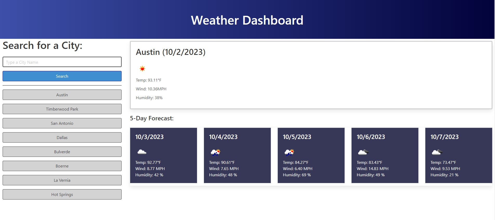

# WeatherDashboard

## Description

This website allows a user to see the weather outlook for multiple cities so they can plan a trip accordingly.

This was accomplished by:

-setting up a weather dashboard with form inputs for city names

-when a city is searched for or a city is selected from the search history, the user is presented with current and future conditions for that city and the city is added to the search history

-when viewing the current weather conditions for the searched city, the user is presented with the city name, the date, an icon representation of the weather condition, the temperature, the humidity and the windspeed

-when viewing the future weather conditions for the searched city, the user is presented with a 5 day forecast that displays the date, an icon representation of the weather condition, the temperature, the humidity and the windspeed

## Usage

The deployed website can be found in the following location:

https://robertwright0830.github.io/WeatherDashboard/

